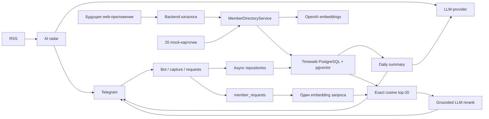

# Архитектура

## Границы системы

Приложение остаётся одним Node.js-процессом, но работа с данными отделена от Telegram, расписаний и LLM через явные асинхронные репозитории. Единственный runtime-источник состояния — PostgreSQL с pgvector. SQLite поддерживается только одноразовым CLI-импортёром и не входит в production-граф приложения.

Основные правила:

1. `application.ts` управляет жизненным циклом: миграции отдельным подключением, readiness-check, репозитории, Telegram polling, scheduler и корректная остановка.
2. Бизнес-сценарии получают `Persistence` и внешние клиенты параметрами; скрытого глобального хранилища нет.
3. LLM возвращает структурированные данные, но не управляет ссылками, Telegram usernames или фактом публикации.
4. Состояние cron-задачи меняется только после подтверждённого внешнего результата.
5. Карточки сначала сохраняются в PostgreSQL, затем независимо индексируются. Ошибка одной карточки не блокирует остальные.

## Потоки данных

Будущее web-приложение не должно подключаться к PostgreSQL прямо из браузера. Оно вызывает собственный backend, а тот нормализует карточку и использует тот же сервис каталога или эквивалентный application API.

## Подбор по `#запрос`

1. Обработчик реагирует только на Telegram entity с точным хэштегом `#запрос` в `TARGET_CHAT_ID`.
2. Запрос атомарно резервируется в `member_requests`. Повторная доставка того же сообщения не запускает второй pipeline.
3. Для текста запроса создаётся один 1536-мерный embedding OpenAI.
4. PostgreSQL вычисляет cosine distance и возвращает точный top-20. При каталоге до 1000 карточек ANN-индекс не нужен: exact search проще и предсказуемее.
5. В поиск попадают только активные карточки, у которых embedding создан текущей моделью и соответствует текущему content hash. Устаревший vector никогда не используется молча.
6. LLM выбирает 3–5 кандидатов только из top-20 и обязан вернуть evidence из карточки. Код проверяет ID и evidence, затем сам формирует упоминания.
7. При менее чем трёх валидных результатах ответ не публикуется. Статус запроса переводится в терминальное состояние.

## Данные

| Таблица | Назначение |
|---|---|
| `schema_migrations` | применённые миграции |
| `messages` | сообщения отслеживаемых топиков |
| `job_state` | состояния радара и сводок |
| `members` | нормализованные карточки и content hash |
| `member_embeddings` | pgvector(1536), модель и hash |
| `member_index_state` | состояние индексации |
| `member_requests` | очередь, идемпотентность и результат запросов |

Telegram id хранятся как `bigint` и на границе приложения проверяются на безопасное преобразование. Удаление старых сообщений выполняется ограниченными батчами. Миграции защищены advisory lock, поэтому конкурентный старт не применит одну миграцию дважды.

## Надёжность и приватность

- Пул ограничен `DATABASE_POOL_MAX`, а каждый SQL statement — `DATABASE_STATEMENT_TIMEOUT_MS`.
- Scheduler останавливается раньше Telegram polling, а пул закрывается последним.
- Зависший `member_requests.processing` можно безопасно вернуть в обработку после configured timeout.
- Логи содержат технические ID, счётчики и классы ошибок, но не тексты запросов, профили, embeddings или ключи.
- Текст карточки и запроса передаётся OpenAI. До загрузки реальных данных нужны согласие участников и проверка требований к трансграничной обработке.
