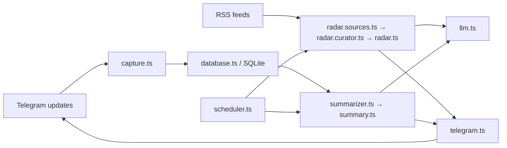

# Архитектура

## Принципы

1. **Вертикальные продуктовые срезы.** Радар живёт в `radar*`, сводка — в `summary*` и `summarizer.ts`.
2. **Один источник состояния.** Сообщения, миграции и состояние cron-задач хранятся в SQLite через `database.ts`.
3. **LLM не управляет публикацией.** Модель возвращает JSON по схеме; код проверяет ссылки и message id, экранирует HTML и решает, когда публиковать.
4. **Явные зависимости.** Telegram `Api` передаётся в отправщики параметром. Глобальных хранилищ и service locator нет.
5. **Состояние после результата.** Успешный запуск фиксируется только после подтверждённой доставки Telegram. Дайджест и сводка обновляют независимые строки SQLite.

## Потоки данных

## Файлы

| Область | Файлы | Ответственность |
|---|---|---|
| Запуск | `index.ts`, `startup.ts` | миграции, polling, preflight, сигналы завершения |
| Telegram | `bot.ts`, `capture.ts`, `telegram.ts` | команды, приём сообщений, надёжная отправка |
| AI-радар | `radar.ts`, `radar.sources.ts`, `radar.curator.ts` | RSS → отбор → HTML → публикация |
| Сводка | `summary.ts`, `summarizer.ts` | окно сообщений → JSON-сводка → deep links → публикация |
| Данные | `database.ts` | SQLite, миграции, сообщения, cron-state, retention |
| Инфраструктура | `scheduler.ts`, `llm.ts`, `config.ts`, `logger.ts`, `types.ts` | cron, провайдеры LLM, env, логи, общие типы |

Тесты находятся рядом с кодом: `*.test.ts`. Новая абстракция оправдана только если у неё есть отдельная ответственность, второй реальный потребитель или изолируемая внешняя граница.

## Надёжность

- Захват принимает сообщения только из `TARGET_CHAT_ID` и `TRACKED_THREAD_IDS`.
- Повторная доставка Telegram обрабатывается SQLite UPSERT-ом.
- Цитаты сводки проходят проверку по id входных сообщений; выдуманные id отбрасываются.
- URL радара принимаются только из входного набора статей.
- Ошибка одного форум-топика не останавливает остальные.
- Полный отказ LLM блокирует публикацию сводки и не продвигает состояние cron.
- Отправка Telegram повторяется один раз; состояние записывается только после успеха.
